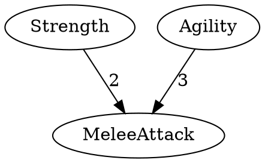

# MappedParametersSystem

Система связывания параметров с поддержкой иерархии зависимостей и cost-based логики.

## Назначение

MappedParametersSystem решает задачу создания **графа зависимостей** между параметрами. Типичные применения:
- **RPG-системы**: дерево навыков, где открытие одного навыка требует другие
- **Прокачка персонажа**: характеристики, зависящие от базовых атрибутов
- **Деревья технологий**: исследования с prerequisite-зависимостями
- **Системы разблокировки**: контент, требующий выполнения условий

## Архитектура

```
┌─────────────────────────────────────────────────────────────────┐
│                         Core Layer                              │
├─────────────────────────────────────────────────────────────────┤
│  ParameterMaps (Bus)     - Точка доступа к картам параметров    │
│  ParametersMap           - Карта (схема) параметров             │
│  GenericParameter        - Параметр с именем и значением        │
│  IParameterMap           - Интерфейс схемы параметра            │
│  IParameterLink          - Интерфейс связи (parent + cost)      │
│  IMappedModel            - Интерфейс модели данных              │
│  ParameterLinkCostLogic  - Логика объединения стоимостей        │
└─────────────────────────────────────────────────────────────────┘
                              │
                              ▼
┌─────────────────────────────────────────────────────────────────┐
│                        Unity Layer                              │
├─────────────────────────────────────────────────────────────────┤
│  MappedParametersDriver  - Драйвер загрузки карт                │
│  ParametersMapStorage    - ScriptableObject хранилище           │
│  MappedParameterPreset   - Производный параметр (редактор)      │
│  MappedParameterLink     - Связь с родителем (редактор)         │
│  MappedModelStorage      - MonoBehaviour-хранилище модели       │
│  [MappedParameter]       - Атрибут для dropdown-выбора          │
│  [MappedModel]           - Атрибут для выбора модели            │
└─────────────────────────────────────────────────────────────────┘
```

## Ключевые концепции

### Карта vs Модель

| Концепция | Назначение | Хранит значения? |
|-----------|------------|------------------|
| `ParametersMap` | Схема связей между параметрами | Нет |
| `IMappedModel` | Экземпляр данных с конкретными значениями | Да |

**Карта** — это blueprint. Она описывает какие параметры существуют и как они связаны.

**Модель** — это экземпляр данных, созданный по карте. Содержит актуальные значения параметров.

### Базовые и Производные параметры

```
┌─────────────┐     ┌─────────────┐
│  Strength   │     │  Agility    │  ← Базовые (корневые)
│  (base)     │     │  (base)     │
└──────┬──────┘     └──────┬──────┘
       │                   │
       │    cost: 2        │    cost: 3
       ▼                   ▼
┌─────────────────────────────────┐
│         Melee Attack            │  ← Производный
│  (depends on Strength, Agility) │
│  CostLogic: And                 │
└─────────────────────────────────┘
```

- **Базовые параметры** (`baseParams`) — корневые узлы без родителей
- **Производные параметры** (`mappedParams`) — зависят от других параметров через `IParameterLink`

### Cost и CostLogic

Каждая связь имеет **стоимость** (`cost`). Интерпретация стоимости определяется контроллером:
- Количество очков для прокачки
- Пороговое значение родителя
- Множитель влияния

Когда у параметра несколько родителей, `ParameterLinkCostLogic` определяет логику объединения:

| Логика | Описание |
|--------|----------|
| `And` | Все условия должны быть выполнены |
| `Or` | Достаточно одного условия |
| `Sum` | Суммирование стоимостей |

## API Reference

### ParameterMaps (Шина доступа)

```csharp
// Получить параметры по типу модели
GenericParameter[] params = ParameterMaps.GetParameters<MyCharacterModel>();

// Получить параметры по имени типа
GenericParameter[] params = ParameterMaps.GetParameters("MyNamespace.MyCharacterModel");

// Получить инициализированную модель
IMappedModel model = ParameterMaps.GetModel<MyCharacterModel>();

// Инициализировать существующую модель
ParameterMaps.InitMap(existingModel);
```

### GenericParameter

```csharp
public class GenericParameter
{
    public event Action OnUpdate;           // Событие изменения значения
    public string Name { get; }             // Название параметра
    public int Value { get; }               // Текущее значение

    public void SetValue(int value);        // Установить значение (триггерит OnUpdate)
}
```

### IMappedModel

```csharp
public interface IMappedModel
{
    event Action OnUpdate;                              // Событие изменения модели

    string[] GetParameters();                           // Список имён параметров
    int GetValue(string parameterName);                 // Значение параметра
    IParameterLink[] GetParents(string name);           // Родители параметра
    GenericParameter GetParameterAsContainer(string name); // Контейнер параметра

    void Init(ParametersMap value);                     // Инициализация картой
}
```

### IParameterLink

```csharp
public interface IParameterLink
{
    string Parent { get; }  // Имя родительского параметра
    int Cost { get; }       // Стоимость связи
}
```

## Использование

### 1. Создание карты параметров

1. Создайте ScriptableObject: `Create > Vortex > Parameters Map`
2. Укажите GUID (выберите тип модели из dropdown)
3. Добавьте базовые параметры (строки)
4. Добавьте производные параметры с указанием родителей и стоимостей

### 2. Реализация модели данных

```csharp
using Vortex.Core.MappedParametersSystem.Base;

public class CharacterStats : IMappedModel
{
    public event Action OnUpdate;

    private Dictionary<string, GenericParameter> _parameters = new();
    private ParametersMap _map;

    public void Init(ParametersMap map)
    {
        _map = map;
        _parameters.Clear();

        foreach (var param in map.GetParameters())
        {
            param.OnUpdate += () => OnUpdate?.Invoke();
            _parameters[param.Name] = param;
        }
    }

    public string[] GetParameters() => _parameters.Keys.ToArray();

    public int GetValue(string parameterName) =>
        _parameters.TryGetValue(parameterName, out var p) ? p.Value : 0;

    public GenericParameter GetParameterAsContainer(string name) =>
        _parameters.GetValueOrDefault(name);

    public IParameterLink[] GetParents(string name) =>
        _map?.GetParameterMap(name)?.Parents ?? Array.Empty<IParameterLink>();
}
```

### 3. Получение модели в runtime

```csharp
// Вариант 1: Через шину
var stats = ParameterMaps.GetModel<CharacterStats>() as CharacterStats;

// Вариант 2: Инициализация существующего экземпляра
var stats = new CharacterStats();
ParameterMaps.InitMap(stats);

// Работа с параметрами
var strength = stats.GetParameterAsContainer("Strength");
strength.OnUpdate += () => Debug.Log($"Strength changed to {strength.Value}");
strength.SetValue(10);
```

### 4. Использование атрибутов в Inspector

```csharp
public class SkillButton : MonoBehaviour
{
    // Dropdown со списком параметров из указанной модели
    [MappedParameter(typeof(CharacterStats))]
    public string targetParameter;

    // Dropdown со списком всех IMappedModel в проекте
    [MappedModel]
    public string modelType;
}
```

### 5. MonoBehaviour-хранилище

```csharp
public class CharacterStatsStorage : MappedModelStorage
{
    public override event Action OnUpdateLink;

    protected override void Init()
    {
        _data = ParameterMaps.GetModel<CharacterStats>();
        _data.OnUpdate += () => OnUpdateLink?.Invoke();
    }
}

// Использование
var storage = GetComponent<CharacterStatsStorage>();
var stats = storage.GetData<CharacterStats>();
```

## Editor Tools

### Экспорт графа в DOT-формат

`Menu: Vortex > Debug > Export Mapped Parameters into Graph`

Экспортирует карту параметров в формат DOT (Graphviz) для визуализации зависимостей.



Визуализация: [Graphviz Online](https://dreampuf.github.io/GraphvizOnline/)

### Валидация в Inspector

Система автоматически проверяет:
- Уникальность имён параметров
- Существование родителей
- Отсутствие циклических зависимостей

При обнаружении ошибки — красный InfoBox с описанием.

## Архитектурные решения

| Решение | Обоснование |
|---------|-------------|
| `FullName` как GUID | Уникальность в рамках сборки, читаемость в логах |
| `null`-возврат при ошибках | Ошибка обрабатывается внешней логикой, не ломает flow |
| Разделение Map/Model | Карта — immutable blueprint, модель — mutable state |
| Cost как int | Достаточно для большинства игровых механик |

## Ограничения

- Значения параметров — только `int`
- Базовые параметры не могут иметь родителей (разделение для удобства редактора)
- Производные параметры могут наследоваться от других производных (цепочки зависимостей)
- Циклические зависимости автоматически разрываются в Editor
- GUID карты должен совпадать с `FullName` типа модели

## Файловая структура

```
MappedParametersSystem/
├── Core/
│   ├── Bus/
│   │   └── ParameterMaps.cs          # Шина доступа
│   ├── Base/
│   │   ├── GenericParameter.cs       # Параметр
│   │   ├── ParametersMap.cs          # Карта параметров
│   │   ├── IMappedModel.cs           # Интерфейс модели
│   │   ├── IParameterMap.cs          # Интерфейс схемы параметра
│   │   ├── IParameterLink.cs         # Интерфейс связи
│   │   └── ParameterLinkCostLogic.cs # Enum логики стоимости
│   └── IDriverMappedParameters.cs    # Интерфейс драйвера
│
└── Unity/
    ├── MappedParametersDriver.cs     # Драйвер (partial)
    ├── MappedParametersDriverExtLoading.cs  # Загрузка карт
    ├── MappedParametersDriverExtEditor.cs   # Editor-расширения
    ├── Base/Preset/
    │   ├── ParametersMapStorage.cs   # ScriptableObject хранилище
    │   ├── ParametersMapExtErrorCheck.cs  # Валидация
    │   ├── ParametersMapExtClipboard.cs   # Copy/Paste
    │   ├── MappedParameterPreset.cs  # Производный параметр
    │   └── MappedParameterLink.cs    # Связь родитель-потомок
    ├── Handlers/
    │   └── MappedModelStorage.cs     # MonoBehaviour-хранилище
    ├── Attributes/
    │   ├── MappedParameterAttribute.cs    # Атрибут выбора параметра
    │   ├── MappedModelAttribute.cs        # Атрибут выбора модели
    │   └── *AttributeDrawer.cs            # Property Drawers
    └── Editor/
        └── MappedParameterGraphExporter.cs # DOT-экспорт
```
